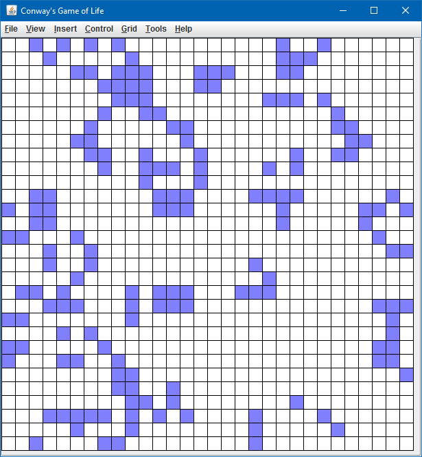

# Conway's Game of Life
*Date: December 2008*

One of my older projects, when I was learning a lot about the Java Swing Framework. I came across the concept of cellular automation and was fascinated, so I decided to try and put together a project.

Not all of the menu items are functional, but the essentials are there - draw your pattern onto the grid and press <ctrl>+<enter> to see your cells comes to life!

**Notable Features**
   * Fully functioning Conway's Game of Life Simulator with wrap-around edges.
   * Functioning GUI
      * Draw with the Pencil and Eraser tools to create your pattern
      * Includes both Play/Pause and Step Foward
      * Zoom In and Zoom Out



### Compiling and Running

```bash
mkdir out
javac -d out src/*.java
java -cp .;out Program
```
