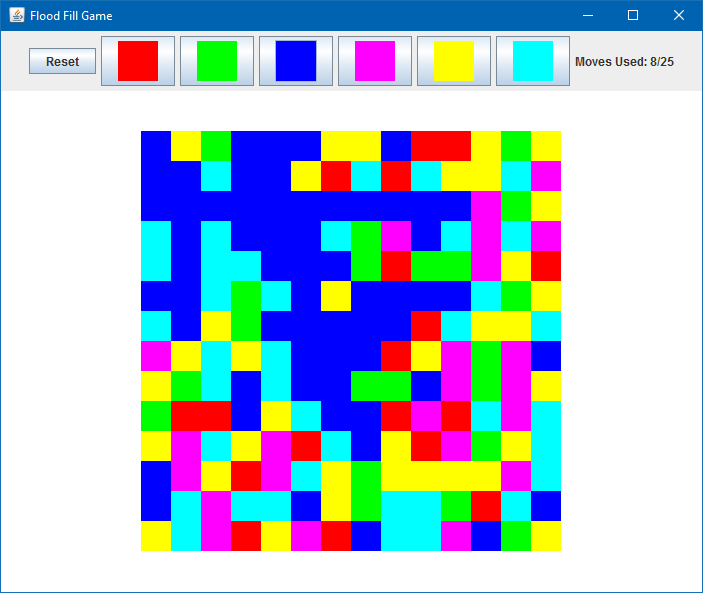
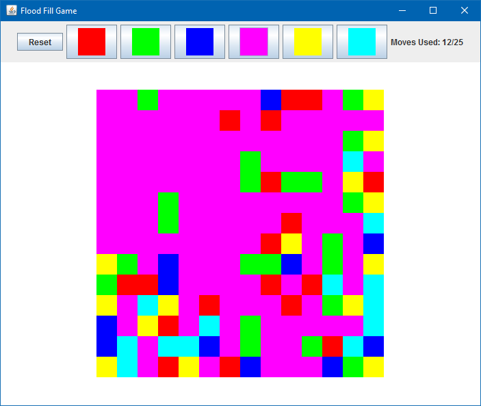

# Flood Fill Game in Java
*Date: October 2011*

Java implementation of the classic Flood Fill Game. I wrote this as a challenge to myself back in school, to see if I could make a Flood Fill Game clone in less than 3 hours for a friend. I made the deadline :)

Selecting a color will do a Flood Fill on the upper left corner with the chosen color. You have 25 moves to fill the entire screen with a single color.





### Compiling and Running

```bash
javac -d . src/*.java
jar cfe FloodFill.jar FloodFill *.class img
del *.class
java -jar FloodFill.jar
```