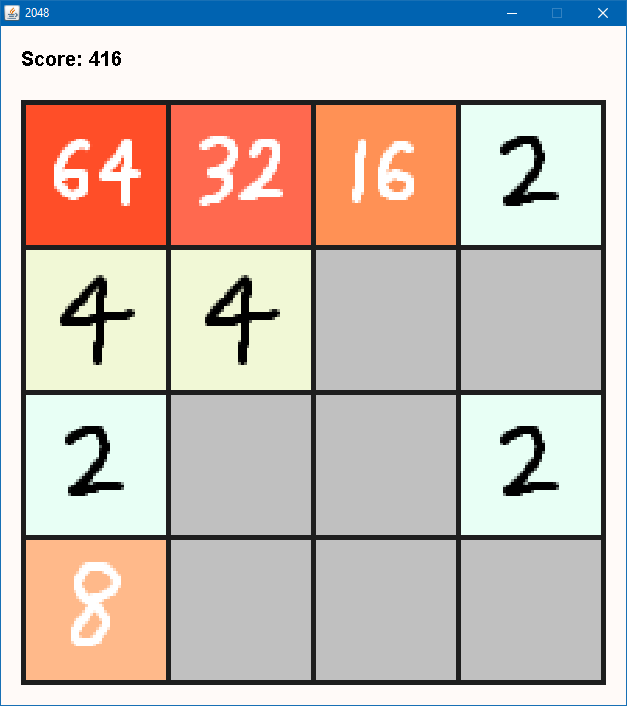

# Java2048

*Date: March 2014*

This is a clone of 2048 that I made for fun over a few days in Java.

Notable Features
   * Animations for tile entrance, tile combination, and sliding.
   * Works on touch devices via drag-drop support.
      * Direction is calculated based on angle after dragging some specified distance.
   * Inputs are queued up for processing to avoid losing keystrokes made by fast players.



### Compiling and Running

```bash
mkdir out
javac -d out src/*.java
java -cp .;out Program
```
