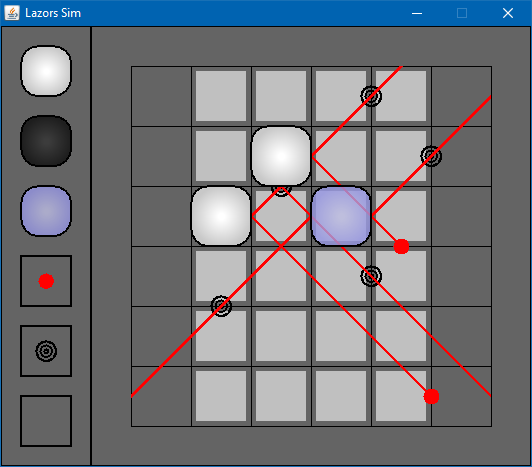

# LazorsSim

*Date: April 2013*

This simulator was born out of boredom and laziness. Back in 2013, I was addicted to a puzzle game on iOS. The objective of the game was to move different types of blocks around on a board in order to reflect the laser(s) through different targets. Light up all the targets, and you beat the level.

Well... there was one level I was particularly stuck on. I joked with my friend that I should just come up with a simulator for the game with a built in solver. "Haha, you should do that," he replied.

**Notable Features**
   * Drag and drop support allows you to build any level by pulling items from the toolbox on the left.
   * Implemented algorithm for determining the path of the laser, including 3 different types of block physics.
   * Built-in solver that finds the solution for any level.



### Controls
   * Drag and drop from the toolbox on the left to create a level.
      * Blocks may only be placed on light cells.
      * Lasers and targets may only be placed on edges.
   * Right click on a cell to toggle whether or not a block may be placed there.
   * Right click a laser to adjust its firing angle.
   * Press 'S' to allow the solver to move the blocks around such that all targets are struck by the lasers.

### Compiling and Running

```bash
mkdir out
javac -d out src/*.java
java -cp .;out LazorsSim
```
