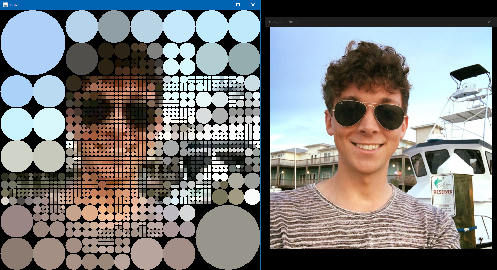

# Animated Mouse-Over Image of Dots
*Date: September 2014*

This is an imitation of a JavaScript demo I saw on the web ages ago. I promised myself that I would try to recreate it, and so years later...!

After selecting an image, you're shown a single large colored circle. When you mouseover this circle, it splits into 4 more colored circles. After repeating this process several times, the original image will be revealed in the form of many small colored circles.

Try it out on images of your own! :)

*NOTE: Currently, the input image must be square, where the length/width is a power of 2.*



### Compiling and Running

```batch
mkdir out
javac -d out src/*.java
java -cp .;out Program
```

To run the included ImageUtilityTest:
```batch
java -cp .;out ImageUtilityTest
```

