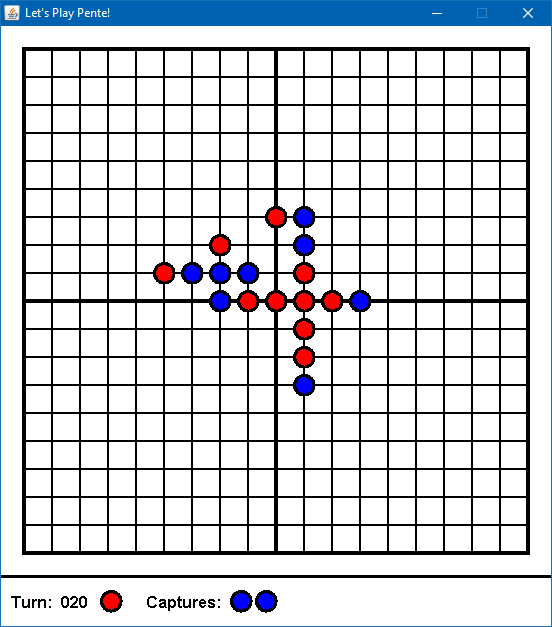

# Pente
*Date: July 2012*

A simple implementation of the game of Pente. Players take turns placing stones on intersections of the grid. The goal is to place 5 stones in a row (horizontally, veritically, or diagonally) before your opponent does. You may capture the stones of your opponent by surrounding two of their stones with two of your own.

**Notable Features**
   * Fully functioning GUI - mouse over an intersection and click to place a stone.
   * Game is fully functional, detecting both wins and captures.



### Compiling and Running

```bash
mkdir out
javac -d out src/*.java
java -cp .;out MainCanvas
```
