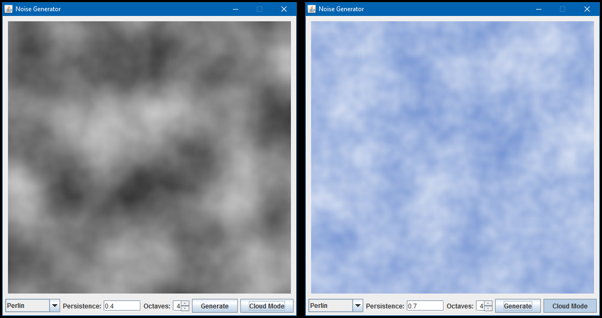

# Perlin Noise Generator in Java
*Date: August 2012*

While doing some research on how Minecraft terrain generation was done, I came across a blog post that credited Perlin Noise. I did some research on the origins of this noise algorithm, and ended up finding a presentation containing details of its mathematical formulation. I decided to try and implement it for myself!

NoiseGenerator has a drop-down which allows you to select from a few different types of noise, one of which is Perlin. NoiseGenerator3D, while slightly unfinished, is an attempt at extending the algorithm to 3 dimensions.



### Compiling and Running

```batch
mkdir out
javac -d out src/*.java
java -cp .;out NoiseGenerator
java -cp .;out NoiseGenerator3D
```