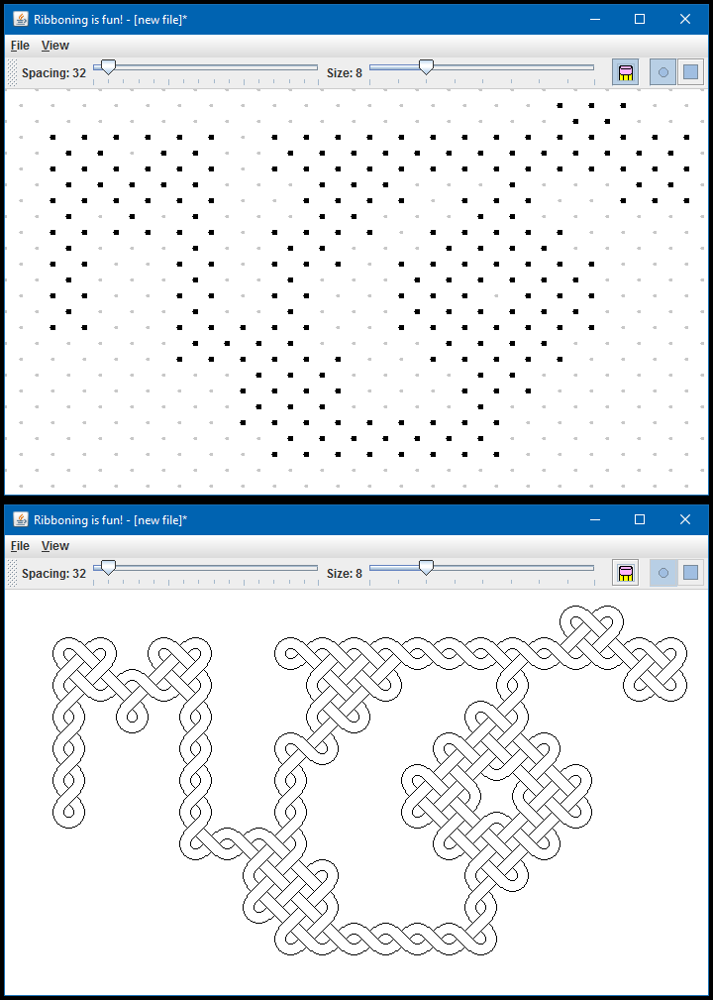

# Ribboning Editor
*Date: January 2010*

The origin of this project dates back to elementary school. We learned a drawing technique where you would set up an outline in dots, then slowly draw ribbon segments between the dots in special patterns. When you were finished, you could erase your dots, leaving a complex pattern of interwoven ribbon.

It stuck with me, and years later, I developed an editor that allowed you to visualize your pattern without spending the hours necessary to to draw it by hand.

**Notable Features**
   * Nice GUI for editing your pattern. Click to add a dot, and toggle "edit mode" to see your pattern.
   * Upon leaving "edit mode", an algorithm detects patterns in the selected dots and draws in the ribbon segments appropriately.



*NOTE: While a "save" feature was in work, it was never completed, unfortunately... Maybe some day :)*

### Compiling and Running

```bash
mkdir out
javac -d out src/*.java
java -cp .;out Program
```
