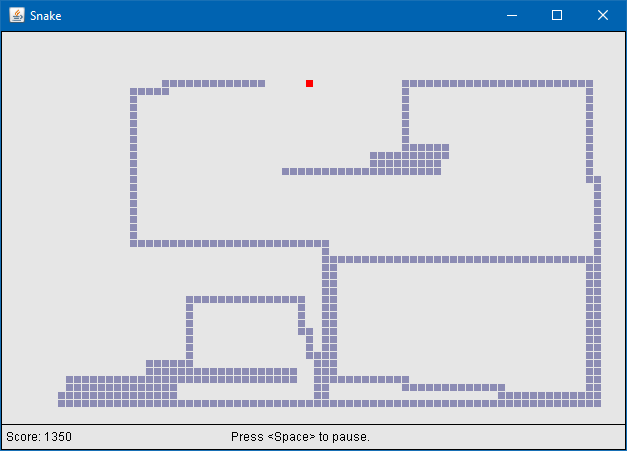

# Snake
*Date: June 2009*

An implementation of the classic game "Snake", a favorite of mine at the time.

**Notable Features**
   * Key pressed are queued to enable very quick inputs. Allows for near-death manuevers.
   * Three different pellet types
      * Normal Pellets simply increase the size of the snake
      * Bonus Pellets appear at random, and disappear after some amount of time.
      * Reverse Pellets will flip the direction of the snake when eaten. Tread carefully!
   * Supports "Computer Mode", where inputs are simulated such that the snake runs in a perfect cycle, hitting every cell exactly once (the computer will play until the snake fills the entire screen).



### Controls

| Key        | Effect                  |
|------------|-------------------------|
| Space Bar  | Start/pause the game    |
| Arrow Keys | Move the snake          |
| E          | Toggle "computer mode"  |
| Q          | Cycle the speed setting |

### Compiling and Running

```bash
mkdir out
javac -d out src/*.java
java -cp .;out Program
```
