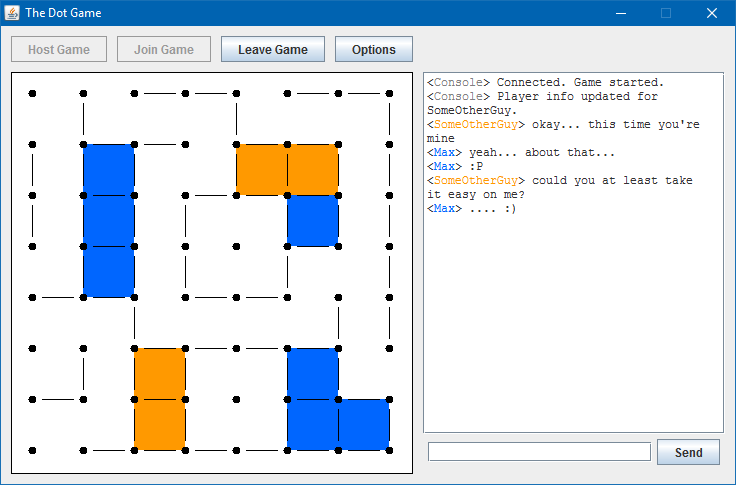

# The Dot Game
*Date: August 2011*

Java implementation of the Dot Game, where two players take turns connecting dots, each hoping to complete more squares than the other.

I wrote this game while experimenting with making networked games in Java.

Notable Features
   * Allows two players to play over the network (or localhost, by opening two clients on the same machine)
   * Functioning chat room between the two players (with colors!)



### Compiling and Running

```bash
mkdir out
javac -d out src/*.java
java -cp .;out Program
```